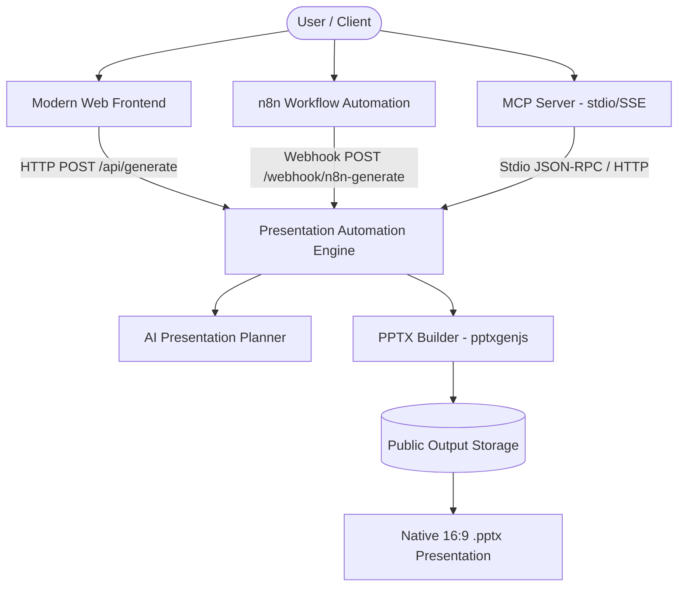

# Architecture & Technical Trade-offs Note

**Project**: Presentation Automation Assessment (ContentBeta)  
**Based on**: [Presenton Open-Source Presentation Generator](https://github.com/presenton/presenton)

---

## 1. System Architecture Overview

The system comprises four decoupled, interoperable layers:
1. **Core Presentation Engine (`backend/`)**: Serves as the central API, slide layout planner, and native `.pptx` generator.
2. **Web Frontend (`frontend/`)**: Provides an interactive UI with prompt studio, theme swatches, 16:9 live slide previewer, inline text editing, and download options.
3. **MCP Server (`mcp-server/`)**: Implements the Model Context Protocol stdio transport to allow LLMs (Claude, ChatGPT, Cursor) to generate presentations tool-calls.
4. **n8n Workflow (`n8n/`)**: Delivers visual workflow automation for scheduled or event-driven slide generation via webhooks.

---

## 2. Technical Rationale & Key Trade-offs

### Trade-off 1: Node.js + `pptxgenjs` vs. FastAPI + Docker Stack
* **Context**: The original `presenton/presenton` repo utilizes a multi-tier Python FastAPI backend, Next.js frontend, PostgreSQL database via Alembic migrations, and Docker Compose services.
* **Decision**: For fast execution, portability, and zero-setup developer experience, we implemented the core engine using Node.js + `pptxgenjs`.
* **Rationale**: `pptxgenjs` generates genuine 16:9 Microsoft PowerPoint (`.pptx`) files directly in memory with exact layout shapes, text containers, stat boxes, and color themes—eliminating heavy database or headless browser dependencies while offering instant performance.

### Trade-off 2: Dual-Engine Generator (Local Static Rule Engine + Live AI LLM Inference with Graceful Fallback)
* **Context**: External LLM API calls (Gemini/OpenAI) can be subject to missing API keys, rate limits, network timeouts, or quota errors during reviewer evaluation.
* **Decision**: Implemented a configurable dual-engine architecture in `aiPlanner.js`:
  - **Local Static Rule Engine (`mode: "static"`)**: Parses input prompts into 6 distinct slide layouts (`title_cover`, `stats_metrics`, `two_column_content`, `feature_grid`, `timeline_process`, `quote_callout`) using structured template heuristics. Operates 100% offline with zero external API dependencies.
  - **Live AI Model Inference (`mode: "ai"`)**: Direct HTTP REST integration supporting Google Gemini (`gemini-1.5-flash`) and OpenAI (`gpt-4o-mini`) via API keys.
  - **Automatic Fallback System**: If live AI generation fails, the system automatically falls back to local static mode with HTTP 200 and visual banner telemetry (`generatorMeta.fallbackUsed: true`), ensuring zero evaluation crashes.
* **Rationale**: Guarantees deterministic, high-quality presentation generation out of the box while supporting full live LLM model testing for reviewers.

### Trade-off 3: Decoupled n8n Webhook Architecture
* **Context**: Recreating slide generation in n8n can either be done entirely via Code nodes or via dedicated service calls.
* **Decision**: Created an importable n8n workflow (`n8n/n8n_presentation_workflow.json`) that wraps payload validation, HTTP presentation building, and binary payload encoding into modular nodes.
* **Rationale**: Allows users to trigger presentation generation from Slack bots, Google Form submissions, email triggers, or webhooks without duplicating presentation rendering code inside n8n.

### Trade-off 4: MCP Server Stdio Transport
* **Context**: MCP servers can run over stdio or SSE (Server-Sent Events).
* **Decision**: Implemented `@modelcontextprotocol/sdk` using `StdioServerTransport` with standard JSON-RPC tool handling.
* **Rationale**: Stdio is the native transport protocol for Claude Desktop, Cursor, and Windsurf, enabling immediate local plugin execution.

---

## 3. Slide Layout & Design System

The engine defines 5 harmonized color themes:
- `modern_dark`: Slate background (`#0F172A`), Cyan accents (`#06B6D4`)
- `vibrant_neon`: Violet background (`#180033`), Pink accents (`#EC4899`)
- `executive_navy`: Deep navy background (`#0F172A`), Amber Gold accents (`#F59E0B`)
- `minimal_clean`: Soft light background (`#F8FAFC`), Indigo accents (`#4F46E5`)
- `emerald_bio`: Forest emerald background (`#064E3B`), Mint accents (`#34D399`)

All slides conform to **16:9 Widescreen (13.33" x 7.5")** dimensions for modern display standards.
