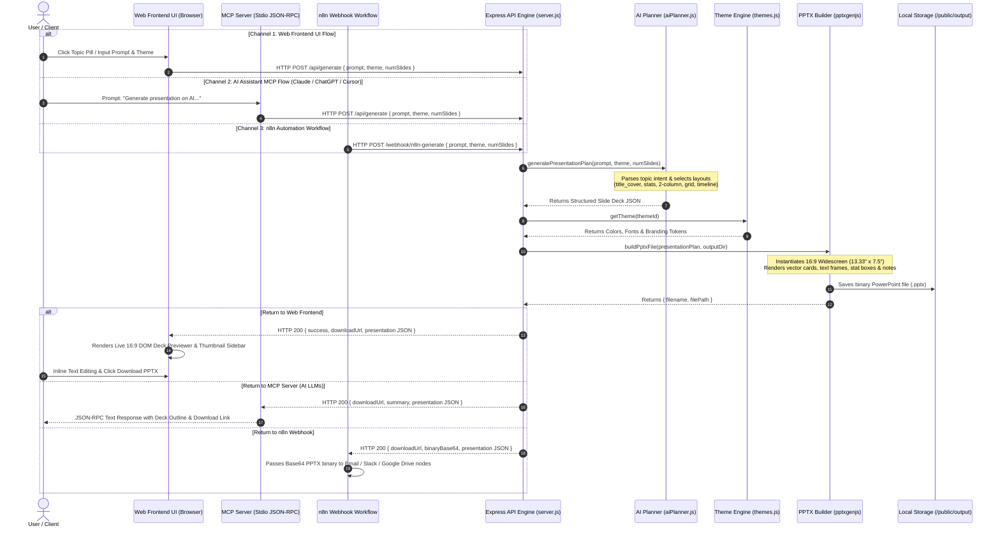

# Detailed System Workflow & Data Flow Guide

> **Presenton Presentation Automation Suite**  
> Comprehensive end-to-end technical documentation detailing the step-by-step execution workflows across all three integration channels: **Web Frontend UI**, **MCP Server (AI LLMs)**, and **n8n Webhook Automation**.

---

## 📐 1. High-Level End-to-End Sequence Diagram



---

## 🔄 2. Channel-by-Channel Detailed Workflows

### Channel 1: Web Frontend UI Workflow ([`frontend/`](file:///Users/kt/workspace/presenton-automation/frontend))

1. **User Interaction & Prompt Studio:**
   - The user opens `http://localhost:5001` in the browser.
   - The user enters a custom presentation prompt (or clicks a preset topic pill e.g. `🏥 AI Healthcare`, `🚀 Startup Pitch`, `📈 Q3 Financials`).
   - The user selects a design theme (`Modern Dark`, `Vibrant Neon`, `Executive Navy`, `Minimalist Clean`, or `Emerald Bio`) and slide count.
2. **HTTP Dispatch:**
   - `frontend/app.js` captures form input and sends `POST /api/generate` with payload `{ prompt, theme, numSlides }`.
   - UI shows a modern glassmorphism loading animation.
3. **Response Handling & Live 16:9 Previewer:**
   - Once the backend responds with HTTP 200 containing `presentation` deck JSON and `downloadUrl`, `app.js` dynamically renders the slide deck.
   - **Thumbnail Sidebar:** Renders thumbnail slides on the left pane allowing click-to-view navigation.
   - **16:9 Main Preview Canvas:** Renders the active slide using exact 16:9 proportion CSS containers matching the theme color tokens.
   - **Live Inline Text Editing:** Title and body containers are set with `contenteditable="true"`, allowing users to tweak content directly in browser.
4. **Binary PPTX Download:**
   - User clicks **Download PPTX**. Browser triggers binary download from `http://localhost:5001/api/download/:filename`.

---

### Channel 2: Model Context Protocol (MCP) Server Workflow ([`mcp-server/`](file:///Users/kt/workspace/presenton-automation/mcp-server))

1. **Initialization & Stdio Connection:**
   - When Claude Desktop, ChatGPT, Cursor, Windsurf, or Antigravity launches, it spawns `node mcp-server/dist/index.js` using `@modelcontextprotocol/sdk`.
   - The MCP server connects to standard input/output (`StdioServerTransport`).
2. **Tool Discovery (`tools/list`):**
   - The AI client sends a JSON-RPC request `method: "tools/list"`.
   - MCP server advertises 3 registered tools:
     - `generate_presentation`: Creates 16:9 `.pptx` deck from prompt.
     - `list_presentation_themes`: Returns theme color palettes & layout specs.
     - `generate_from_outline`: Converts custom structured slide JSON directly into PowerPoint files.
3. **Tool Call Execution (`tools/call`):**
   - The user asks the AI: *"Generate a 5-slide presentation on AI in Healthcare using modern_dark theme."*
   - The AI client sends a JSON-RPC request `method: "tools/call"` with arguments `{ prompt, theme, num_slides }`.
   - MCP server forwards an HTTP POST request to the local Express backend `http://localhost:5001/api/generate`.
4. **AI Assistant Response Generation:**
   - Upon receiving the generated deck metadata and `downloadUrl` from the Express engine, the MCP server returns formatted JSON-RPC text.
   - The AI client displays the slide outline summary and clickable `.pptx` download link directly in chat.

---

### Channel 3: n8n Webhook Workflow Automation ([`n8n/`](file:///Users/kt/workspace/presenton-automation/n8n))

1. **Event Triggering:**
   - An external event (e.g. Google Form submission, Slack bot command, scheduled cron, or cURL request) hits `POST http://localhost:5001/webhook/n8n-generate`.
2. **Backend Webhook Handler Execution:**
   - `server.js` receives the webhook payload, parses prompt parameters, generates the slide deck plan via `aiPlanner.js`, and renders the `.pptx` file via `pptxgenjs`.
3. **Binary Base64 Encoding:**
   - Express server reads the rendered binary `.pptx` file from disk into a memory buffer and converts it to a `base64` data string (`fs.readFileSync(filePath).toString("base64")`).
4. **n8n Binary Payload Delivery:**
   - Backend responds to n8n with:
     ```json
     {
       "status": "success",
       "source": "n8n_webhook",
       "presentationId": "presentation_1789198073824_yrvgc",
       "downloadUrl": "http://localhost:5001/api/download/presentation_1789198073824_yrvgc.pptx",
       "binaryBase64": "<base64_encoded_pptx_data>",
       "presentation": { ... }
     }
     ```
   - The n8n importable workflow (`n8n/n8n_presentation_workflow.json`) attaches this binary buffer directly to email attachments, Google Drive uploads, or Slack messages.

---

## ⚙️ 3. Under the Hood: Core Engine Code Execution Steps

When any channel requests a presentation, the core presentation engine (`backend/src`) executes the following internal sequence:

```
[HTTP Request]
     │
     ▼
1. server.js ──────────────────► Validates request payload & theme parameters
     │
     ▼
2. aiPlanner.js ───────────────► Maps prompt intent to 6 slide layout paradigms:
                                 • title_cover       (Slide 1)
                                 • stats_metrics     (Slide 2)
                                 • two_column_content(Slide 3)
                                 • feature_grid      (Slide 4)
                                 • timeline_process  (Slide 5)
     │
     ▼
3. themes.js ──────────────────► Resolves color tokens (bg, primary, card, text)
     │
     ▼
4. pptxBuilder.js ─────────────► Instantiates pptxgenjs (16:9 widescreen layout)
                                 • Renders slide backgrounds & accents
                                 • Draws vector cards & stat containers
                                 • Wraps title, body text & bullet points
                                 • Injects speaker notes
     │
     ▼
5. Output Storage ─────────────► Writes binary .pptx to /backend/public/output/
     │
     ▼
[HTTP Response] ───────────────► Serves file download via /api/download/:filename
```

---

## 🧪 4. How to Verify All Workflows Locally

Run all workflow verifications:

### Test 1: Core Engine HTTP API (Local Static Mode)
```bash
curl -X POST http://localhost:5001/api/generate \
  -H "Content-Type: application/json" \
  -d '{"prompt": "AI in Healthcare", "theme": "modern_dark", "numSlides": 5, "mode": "static"}'
```

### Test 2: Core Engine HTTP API (Live AI Mode with Gemini)
```bash
curl -X POST http://localhost:5001/api/generate \
  -H "Content-Type: application/json" \
  -d '{"prompt": "AI in Healthcare", "theme": "modern_dark", "numSlides": 5, "mode": "ai", "provider": "gemini", "apiKey": "YOUR_GEMINI_API_KEY"}'
```

### Test 3: MCP Stdio JSON-RPC Execution
```bash
cd mcp-server && node dist/index.js <<< '{"jsonrpc": "2.0", "id": 1, "method": "tools/call", "params": {"name": "generate_presentation", "arguments": {"prompt": "Cybersecurity", "theme": "vibrant_neon", "num_slides": 3, "mode": "static"}}}'
```

### Test 4: n8n Webhook Binary Payload Delivery
```bash
curl -X POST http://localhost:5001/webhook/n8n-generate \
  -H "Content-Type: application/json" \
  -d '{"prompt": "SaaS Growth 2026", "theme": "executive_navy", "numSlides": 4}'
```
